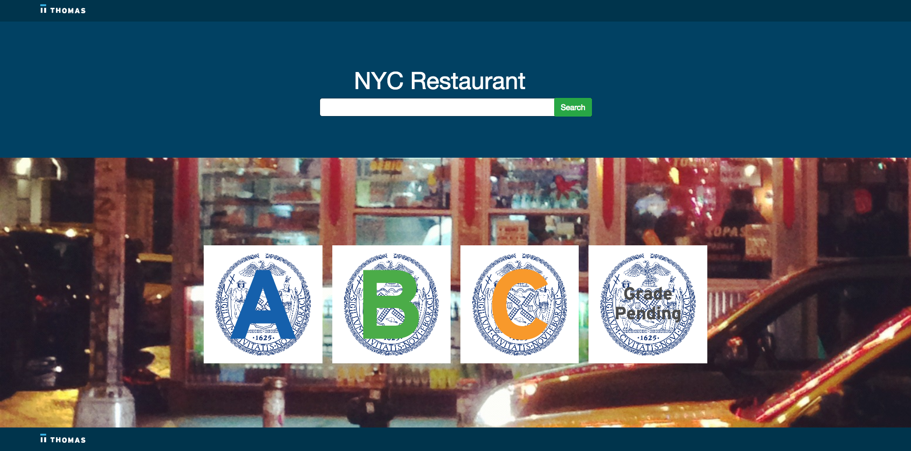
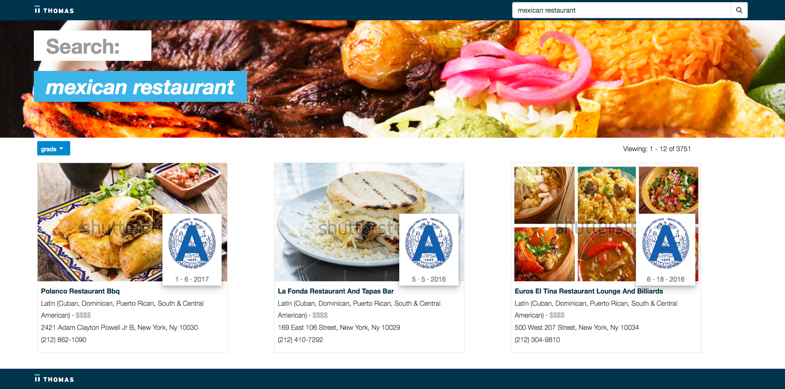
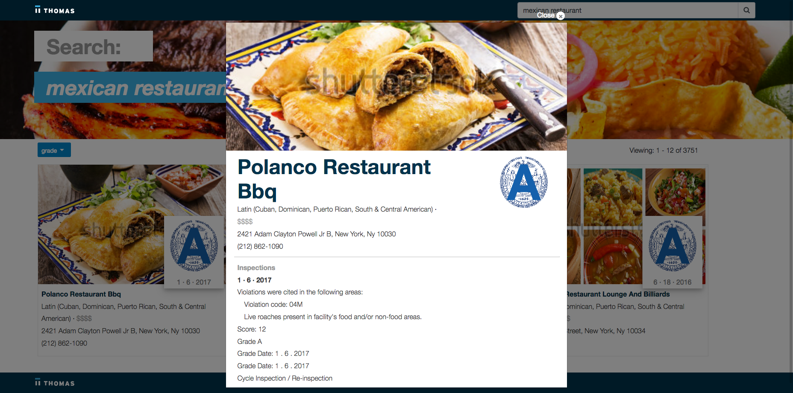
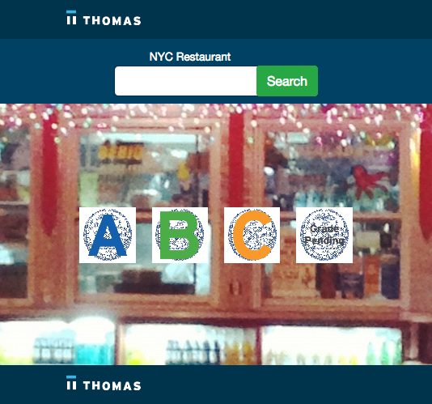
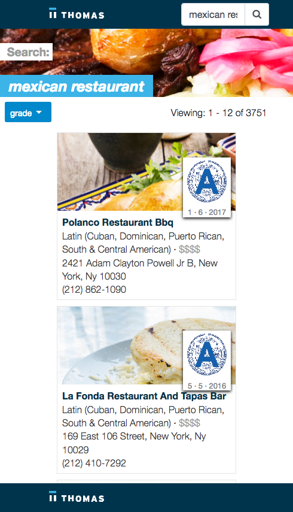
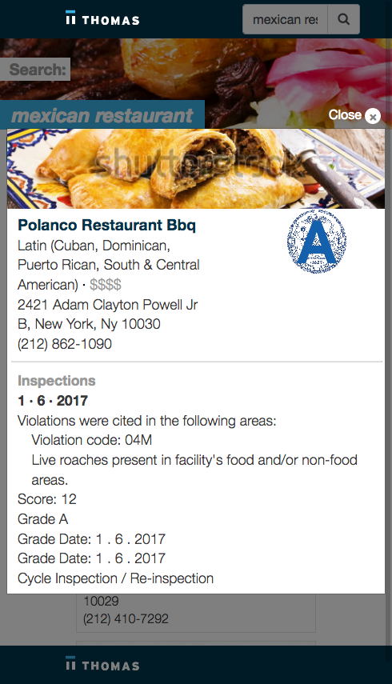
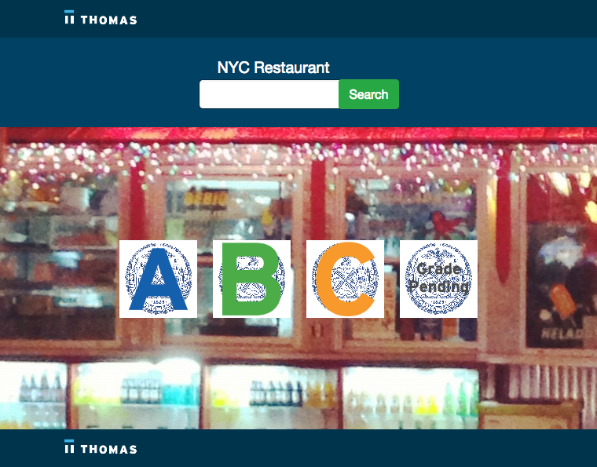
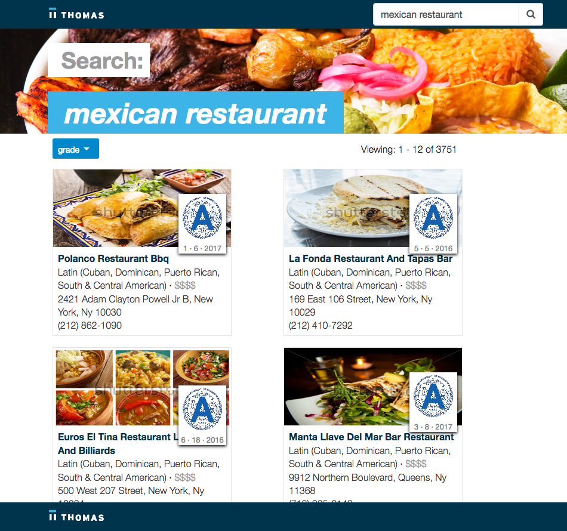
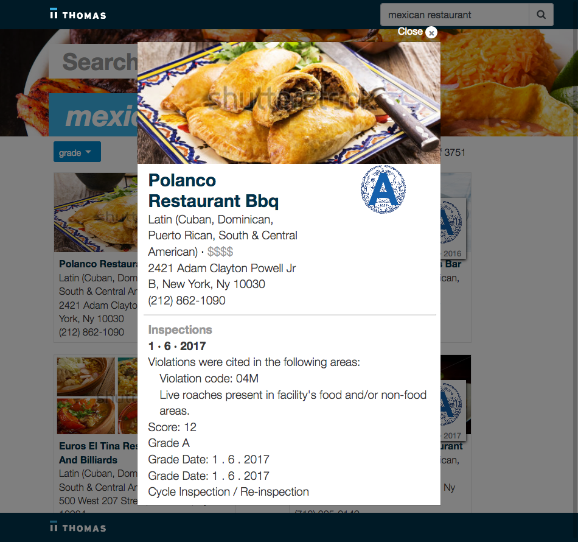

### NYC Restaurants 

Frontend and backend are separated:<br>
ux: client-app<br>
backend: service<br>

The document manipulation is handle in the backend, leaving the ux only for display content. 


from the root of the project:<br>
this will build the backend and frontend.
```
npm install
```
How to test the project:<br>
this will start the backend and frontend. <br>
backend:  http://localhost:8080/ <br>
frontend: http://localhost:4200/
```
npm start
```
MongoDB connection to a localhost

```JS
// change db connection
// service/config/database.js
module.exports = {
    database: 'mongodb://localhost/nyc-restaurants'
}
```

### ßKey Factors:

- The API full search will work only if the fulltext index exist associated to field searchText

```
db.Restaurant.createIndex({"searchText":"text"})
```

- Price field missing from Restaurent Model. I decided to ignore that functionality.
- This is not pixel perfect from the mockup. This is a fair approximation. For a pixel perfect, I will request:
  - Photoshop file
  - Font names and sizes
  - Smaller screen mockup or designer suggestions. 

- API returned collection modified in the service and not in the client. I made this decision because I wanted leave the client-app with logic related to the UX. For a real life project, I will think in service or API performance and loading before to take this kind of decisions.


```JS

Restaurant {
  _id?: string;
  name: string;
  cuisine: string;
  grade: string;
  address: string;
  phone: string;
  imageUrl: string;
  gradeDate: string;
  inspection: {
    grade_date: string;
    grade_date_first: string;
    action: string;
    violation_code: string;
    violation_desc: string;
    score: string;
    grade: string;
    inspection_type: string;
  };
}
```

- Format Date in the API. I made this decision  similar to what I said in N.3 and because I wanted to sort the Inspections object in the API.
- Inspection object was missing in some record and the individual result image didn't show all the information about inspection. Therefore, I decided to bring an unique simplified inspection object.
- Inspections where sorted before to be pick the latest and the first, this for restaurants with more than one inspection.
- In the indiviual view, the first date show in the inspections section represent the first inspection. if the Restaurant only has one inspection entry, it will be repeated. 
- Grade entries from the database has more than A,B,C and Grading Panding. Therefore, anything that was not A,B,C were marked as Grading Pending.
- used mongoose-aggregate-paginate to simplify my life with the results and pagination
- I used Bootstrap Pagination with arrows because some results there were really big.
- Key Files:

```JS
// API calls
service/routes/api.js
service/utils/utils.js

// Rest Service Front-End Back-End interaction:
client-app/src/app/services/rest.service.ts

// home components
client-app/src/app/home/home.component.ts
client-app/src/app/home/home.component.html 

// results components
client-app/src/app/results/results.component.ts
client-app/src/app/results/results.component.html
client-app/src/app/results/results.component.scss
```

### Screenshoot 
- Homepage


- Results 


- Individual


-  Responsive Design Sample:
- Small
- Homepage



- Results 



 - Individual


- Medium
- Homepage



- Results 



- Individual



### Development Process 
1. Create backend api with NodeJS and Express 
2. Add package: 
- mongoose connect to MongoDb
- mongoose-aggregate-paginate simplify MongoDB queries and results
- nodemon continues developing
3. write utils library.
- In this way, the json data send to UX ready to be used.
4. Api call example:
- http://localhost:8080/api/restaurants/:search/:page/:grade
5. Parameters:
- search: string 100 character max
- page: number 1 as default
- grade: string used to sort
6. Create ux client with Angular 6, Material and bootstrap.
7. responsive UX (I added only 4 different sizes). Tested using Firefox Responsive Design Mode.

### Suggestions

- It is not pixel perfect of the requirement. Instead, it is a fair approach. 
- Dropdown filters by Grade, Cusine, Date of Inspection. 
- Add Number of results. Now is 12 but can be added as dropdown.
- Add Cache results, avoid to API call for existing results
- Remove Formating Fields from Service and put it n the Client-app.
- Better variable names.
- Add more MongoDB index. 
- More responsible screen types and standard media query break points.


References
------------------
1. https://stackoverflow.com/questions/46117989/what-is-the-recommended-way-to-dynamically-set-background-image-in-angular-4
2. https://stackoverflow.com/questions/45696685/bootstrap-4-search-input-with-an-icon
3. https://getbootstrap.com/docs/4.0/components/input-group/
4. https://angular.io/guide/
5. https://css-tricks.com/books/volume-i/scale-typography-screen-size/
6. https://www.npmjs.com/package/mongoose-aggregate-paginate
7. https://ng-bootstrap.github.io/#/components/pagination/api
8. https://stackoverflow.com/questions/10123953/sort-javascript-object-array-by-date
9. https://getbootstrap.com/docs/4.0/utilities/
10. https://ng-bootstrap.github.io/#/components/modal/examples
11. https://getbootstrap.com/docs/4.0/utilities/text/
12. https://docs.angularjs.org/api/ng/
13. https://www.seamless.com/lets-eat
14. https://www.thomasnet.com/
15. https://css-tricks.com/


Buil with
---------------
```
Your global Angular CLI version (6.1.5) is greater than your local
version (6.1.3). The local Angular CLI version is used.

To disable this warning use "ng config -g cli.warnings.versionMismatch false".

     _                      _                 ____ _     ___
    / \   _ __   __ _ _   _| | __ _ _ __     / ___| |   |_ _|
   / △ \ | '_ \ / _` | | | | |/ _` | '__|   | |   | |    | |
  / ___ \| | | | (_| | |_| | | (_| | |      | |___| |___ | |
 /_/   \_\_| |_|\__, |\__,_|_|\__,_|_|       \____|_____|___|
                |___/
    

Angular CLI: 6.1.3
Node: 9.4.0
OS: darwin x64
Angular: 6.1.2
... animations, common, compiler, compiler-cli, core, forms
... http, language-service, platform-browser
... platform-browser-dynamic, router

Package                           Version
-----------------------------------------------------------
@angular-devkit/architect         0.7.1
@angular-devkit/build-angular     0.7.1
@angular-devkit/build-optimizer   0.7.1
@angular-devkit/build-webpack     0.7.1
@angular-devkit/core              0.7.1
@angular-devkit/schematics        0.7.3
@angular/cdk                      6.4.3
@angular/cli                      6.1.3
@angular/material                 6.4.3
@ngtools/webpack                  6.1.1
@schematics/angular               0.7.3
@schematics/update                0.7.3
rxjs                              6.2.2
typescript                        2.9.2
webpack                           4.9.2
```


by Francia